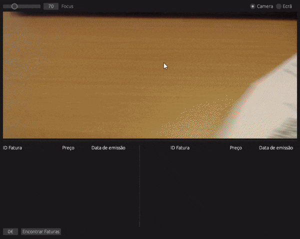

# PtInvoiceParser

Starting on January 2022 all invoices in Portugal started to be issued with a QR code containing [most of the information](https://www.softseguro.pt/Files/ETCODEQR.pdf) of the invoice. 

This projects explores two different ways to parse this invoices. One built with Rust that provides a simple GUI where invoices can be grabbed from the camera or from the screen and another built with Python that parses invoices from a folder, ideal for batch processing.

## Rust Invoice Parser


The main motivation for building this application was to learn Rust and to explore the possibility of building multi threaded GUI application with a glimpse of computer vision.

This application uses OpenCV with 2 threads to grab images from the screen or from the camera, parse the QR code and then displaying the contents of it on the screen.

In addition to that, it provides a way determine the subset of invoices that best matches a specific values, this can be usefull for Bank reconciliations in the accounting department.

### Building
To build the project it might be needed to install OpenCV libraries. Head over to [OpenCV installation guidelines](https://github.com/twistedfall/opencv-rust/blob/master/INSTALL.md)

## Python Invoice Parser
This is a command line tool that uses OpenCV to capture images from a specific file or directory, parse any QR codes present, and stores their content as table in an excel sheet that can be later used for analysis.

### Installing
Clone the repository and install the package:
```bash
cd python && pip install .
```

### Usage
```bash
ptinvoiceparser -d /path/to/invoices
```

```bash
ptinvoiceparser -f invoice.pdf

```
